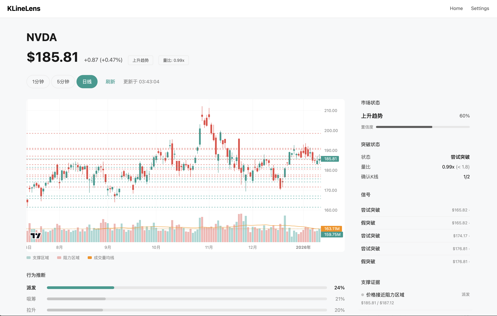

<h1 align="center">KLineLens</h1>

<p align="center">
  <strong>Open-source market structure analysis terminal for traders</strong>
</p>

<p align="center">
  <a href="#features">Features</a> •
  <a href="#quick-start">Quick Start</a> •
  <a href="#accuracy">Accuracy</a> •
  <a href="#providers">Providers</a> •
  <a href="#documentation">Docs</a> •
  <a href="#contributing">Contributing</a>
</p>

<p align="center">
  
  
  
  
  
</p>

<p align="center">
  
</p>

---

## Why KLineLens?

**Real traders, real results.** I built KLineLens to track market structure for QQQ options day trading. The breakout detection system has proven highly accurate in real trading conditions.

| What You Get | Why It Matters |
|--------------|----------------|
| **Structure Analysis** | Know if you're in uptrend, downtrend, or range instantly |
| **Support/Resistance Zones** | Auto-detected S/R levels with strength scoring |
| **Breakout Detection** | 3-factor confirmation (structure + volume + momentum) |
| **Extended Hours Context** | Premarket regime, gap analysis, key levels (YC/PMH/PML) |
| **Behavior Inference** | Wyckoff-inspired probability distribution |
| **Conditional Playbook** | If-then trading plans with entry, target, stop |
| **AI Interpretation** | Time-aware narrative with EH context integration |

> 💡 **Use Case**: Track QQQ/SPY structure on 5-minute charts, use 1-minute for entry timing. The tool tells you when structure confirms a breakout vs when it's likely a fakeout.

---

## Accuracy

Backtested on 6 months of daily data across 19 major tickers:

| Metric | Result |
|--------|--------|
| **Breakout Accuracy** | **98.9%** (±4.6%) |
| **Fakeout Detection** | **88.9%** (±31.4%) |
| **Signal Hit Rate** | 73.8% |
| **Total Trading Days** | 2,432 |

<details>
<summary>Per-Ticker Results</summary>

| Ticker | Breakout Acc | Fakeout Det | Signal Hit |
|--------|-------------|-------------|------------|
| QQQ | 100% | - | 100% |
| SPY | 100% | - | 67% |
| TSLA | 100% | - | 100% |
| NVDA | 96% | 75% | 67% |
| META | 100% | 100% | 64% |
| AAPL | 100% | 100% | 71% |

</details>

Run your own backtest:
```bash
python scripts/run_backtest.py
```

---

## Features

### Market Structure Detection
- **Regime Classification**: Uptrend / Downtrend / Range with confidence score
- **Swing Point Detection**: Fractal-based HH/HL/LH/LL identification
- **Zone Clustering**: ATR-based support/resistance zone detection

### Breakout Analysis
- **3-Factor Confirmation**: Structure (2 closes) + Volume (RVOL ≥ 1.8) + Result (≥ 0.6 ATR)
- **State Machine**: Idle → Attempt → Confirmed / Fakeout
- **Real-time Tracking**: Visual indicators on chart

### Behavior Inference
- **5 Wyckoff Behaviors**: Accumulation, Shakeout, Markup, Distribution, Markdown
- **Probability Distribution**: Softmax-normalized scores
- **Evidence Pack**: Click any evidence to locate on chart

### Trading Playbook
- **Conditional Plans**: Plan A (primary) + Plan B (alternative)
- **Risk Management**: Entry, target, stop-loss, R:R ratio
- **Invalidation Levels**: When plan becomes invalid

### Extended Hours (EH) Context
- **Premarket Analysis**: PMH/PML levels, gap detection, regime classification
- **Session Awareness**: Different analysis modes for premarket/opening/regular/closing
- **Key Levels**: YC (Yesterday's Close), PMH/PML (Premarket High/Low), AHH/AHL (Afterhours)
- **Time-Aware AI**: EH context automatically included based on trading session

### AI Interpretation (Optional)
- **LLM Integration**: OpenAI GPT-4 / Google Gemini support
- **Time-Aware Context**: EH data included during premarket/opening sessions
- **Auto-trigger**: On regime change, breakout state change, behavior shift
- **Bilingual**: Chinese and English output

---

## Quick Start

### Prerequisites
- [Docker Desktop](https://www.docker.com/products/docker-desktop/)

### One Command Setup

```bash
# Clone
git clone https://github.com/songzhiyuan98/KLineLens.git
cd KLineLens

# Configure (optional - defaults work fine)
cp .env.example .env

# Start
docker compose up -d --build

# Open browser
# → http://localhost:3000
```

That's it. Type a ticker and start analyzing.

### Stopping

```bash
docker compose down
```

---

## Providers

KLineLens uses a **pluggable provider architecture**. Switch data sources without code changes.

| Provider | Free Tier | Volume Data | Latency | Best For |
|----------|-----------|-------------|---------|----------|
| **TwelveData** ⭐ | 800 req/day | ✅ Reliable | ~170ms | Recommended |
| **Yahoo Finance** | Unlimited | ⚠️ Partial | ~500ms | Quick start |
| **Alpaca** | Unlimited | ✅ Full | ~200ms | US stocks |
| **Alpha Vantage** | 25 req/day | ✅ Full | ~300ms | Premium data |

### Switching Providers

Edit `.env`:
```bash
# Default (no API key needed)
PROVIDER=yahoo

# Recommended (free, reliable volume)
PROVIDER=twelvedata
TWELVEDATA_API_KEY=your_key

# Alternative
PROVIDER=alpaca
ALPACA_API_KEY=your_key
ALPACA_API_SECRET=your_secret
```

Restart containers:
```bash
docker compose up -d --build
```

> 🔌 **Extensible**: Adding a new provider? Just implement the `MarketDataProvider` interface. See [docs/PROVIDER.md](docs/PROVIDER.md).

---

## Architecture

```
┌─────────────────────────────────────────────────────────┐
│                    Next.js Frontend                      │
│  ┌──────────┐  ┌──────────┐  ┌──────────┐  ┌─────────┐ │
│  │   Chart  │  │  Zones   │  │ Playbook │  │Timeline │ │
│  └──────────┘  └──────────┘  └──────────┘  └─────────┘ │
└─────────────────────────┬───────────────────────────────┘
                          │ REST API
┌─────────────────────────▼───────────────────────────────┐
│                    FastAPI Backend                       │
│  ┌──────────────────────────────────────────────────┐  │
│  │              Analysis Engine (Python)             │  │
│  │  ┌──────────┐ ┌──────────┐ ┌──────────────────┐  │  │
│  │  │Structure │ │ Behavior │ │Playbook Generator│  │  │
│  │  └──────────┘ └──────────┘ └──────────────────┘  │  │
│  └──────────────────────────────────────────────────┘  │
│  ┌──────────────────────────────────────────────────┐  │
│  │         Provider Layer (Pluggable)               │  │
│  │   Yahoo │ TwelveData │ Alpaca │ Alpha Vantage    │  │
│  └──────────────────────────────────────────────────┘  │
└─────────────────────────────────────────────────────────┘
```

---

## Supported Assets

| Type | Examples |
|------|----------|
| **US Stocks** | AAPL, TSLA, NVDA, GOOGL, MSFT, META, AMZN |
| **ETFs** | SPY, QQQ, IWM, DIA, VTI, GLD |
| **Crypto** | BTC/USD, ETH/USD, SOL/USD |

### Timeframes
- **1 minute**: Entry timing, execution level
- **5 minutes**: Intraday structure, day trading
- **Daily**: Swing trading, trend analysis

---

## Configuration

```bash
# .env

# Data Provider
PROVIDER=twelvedata          # yahoo, twelvedata, alpaca, alphavantage
TWELVEDATA_API_KEY=xxx       # Get free key at twelvedata.com

# LLM (optional - for AI interpretation)
OPENAI_API_KEY=xxx           # OpenAI GPT-4
# or
GOOGLE_API_KEY=xxx           # Google Gemini

# Cache
CACHE_TTL=60                 # Seconds

# Ports
API_PORT=8000
WEB_PORT=3000
```

---

## Documentation

| Document | Description |
|----------|-------------|
| [ENGINE_SPEC.md](docs/ENGINE_SPEC.md) | Algorithm specification (structure, behavior, playbook) |
| [API.md](docs/API.md) | REST API reference |
| [PROVIDER.md](docs/PROVIDER.md) | Data provider integration guide |
| [ARCHITECTURE.md](docs/ARCHITECTURE.md) | System design |
| [LLM_SPEC.md](docs/LLM_SPEC.md) | AI narrative with time-aware EH integration |
| [EVALUATION.md](docs/EVALUATION.md) | Backtest methodology and results |
| [CHANGELOG.md](docs/CHANGELOG.md) | Version history |

---

## Development

### Local Setup (without Docker)

```bash
# Backend
cd apps/api
pip install -r requirements.txt
uvicorn src.main:app --reload --port 8000

# Frontend (new terminal)
cd apps/web
npm install
npm run dev
```

### Running Tests

```bash
# Core engine (42 tests)
cd packages/core && python -m pytest tests/ -v

# API (37 tests)
cd apps/api && python -m pytest tests/ -v
```

---

## Roadmap

- [x] **v0.8** - Extended Hours (EH) system, time-aware AI narrative
- [x] **v0.7** - Responsive design, smart chart ranges
- [x] **v0.6** - Bloomberg-style terminal UI
- [x] **v0.5** - TwelveData provider, VSA indicators
- [x] **v0.4** - i18n (Chinese/English)
- [ ] **v1.0** - Signal evaluation tracking, auto-triggered AI updates
- [ ] **v1.1** - Dark mode, WebSocket streaming
- [ ] **v2.0** - Multi-timeframe alignment, mobile support

---

## Contributing

We welcome contributions! See [CONTRIBUTING.md](CONTRIBUTING.md) for guidelines.

### Quick Links
- [Open Issues](https://github.com/songzhiyuan98/KLineLens/issues)
- [TODO List](docs/TODO.md)
- [Collaboration Guide](CLAUDE.md)

### Adding a Provider

1. Implement `MarketDataProvider` interface
2. Add to `providers/__init__.py`
3. Update `.env.example`
4. Submit PR

---

## License

[MIT License](LICENSE) - Use it freely, commercially or personally.

---

## Disclaimer

**For educational purposes only.** This tool provides technical analysis based on price and volume data. It does not constitute financial advice. Always do your own research. Trade at your own risk.

---

<p align="center">
  <sub>Built with ❤️ for traders who want to understand market structure</sub>
</p>
