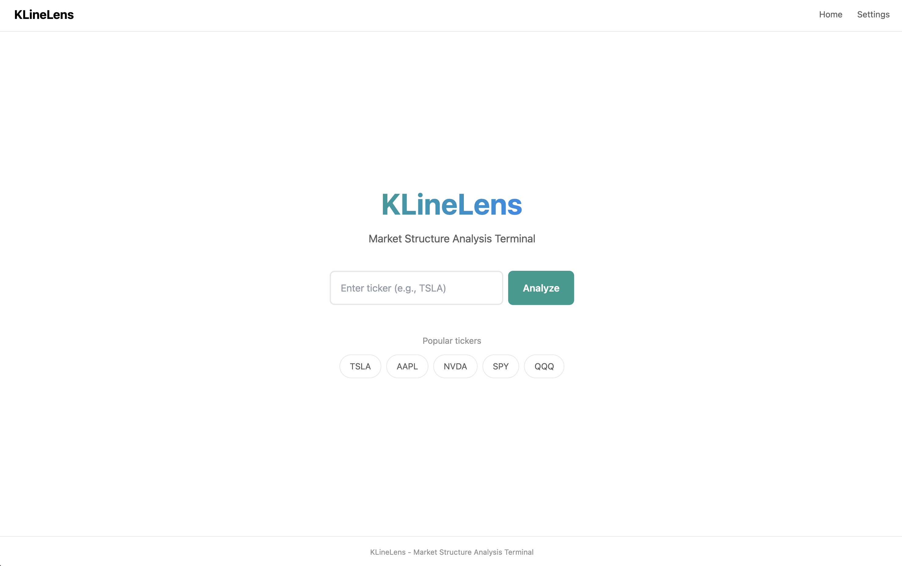

# KLineLens

An open-source local market structure analysis terminal for OHLCV-based trading analysis.

> **Self-hosted**: Run entirely on your local machine via Docker. You control your data.


---

## Screenshots

### Homepage


### Analysis Detail


---

## What It Does

Type a ticker → Get **structure + behavior probabilities + evidence + timeline + conditional playbook**, updated periodically.

| Feature | Description |
|---------|-------------|
| **Market Structure** | Regime detection (trend/range), support/resistance zones |
| **Behavior Inference** | Probability distribution (accumulation/shakeout/markup/distribution/markdown) |
| **Evidence Pack** | Traceable metrics for each inference (click to locate on chart) |
| **Breakout Status** | Volume ratio, confirm closes, state tracking |
| **Signals** | Real-time signal detection with timestamps |
| **Stateful Timeline** | Records structural changes over time |
| **Conditional Playbook** | Plan A/B with entry, target, invalidation |

> ⚠️ **Disclaimer**: Not financial advice. This tool provides rule-based analysis and probability interpretations. See [docs/DISCLAIMER.md](docs/DISCLAIMER.md).

---

## Evaluation Results

Backtested on 6 months of daily data across 19 major tickers (MSFT, GOOGL, AMZN, TSLA, META, SPY, QQQ, etc.):

| Metric | Result |
|--------|--------|
| **Breakout Accuracy** | 98.9% |
| **Fakeout Detection Rate** | 88.9% |
| **Signal Hit Rate** | 73.8% |
| **Total Trading Days** | 2,432 |

Run your own evaluation:
```bash
python scripts/run_backtest.py
```

See [docs/BACKTEST_RESULTS.json](docs/BACKTEST_RESULTS.json) for detailed per-ticker results.

---

## Quick Start (Docker)

### Prerequisites
- [Docker Desktop](https://www.docker.com/products/docker-desktop/) (macOS/Windows) or Docker Engine (Linux)

### One-Command Setup

```bash
# 1. Clone the repository
git clone https://github.com/songzhiyuan98/KLineLens.git
cd KLineLens

# 2. Copy environment template
cp .env.example .env

# 3. Start services
docker compose up --build

# 4. Open your browser
# Web UI: http://localhost:3000
# API Docs: http://localhost:8000/docs
```

### Stopping Services

```bash
docker compose down
```

---

## Configuration

Edit `.env` to customize:

```bash
# Data provider (yahoo is free, no API key needed)
PROVIDER=yahoo

# Optional: Alpaca (free, with volume data)
# PROVIDER=alpaca
# ALPACA_API_KEY=your_key
# ALPACA_API_SECRET=your_secret

# Cache TTL (seconds)
CACHE_TTL=60

# Ports
API_PORT=8000
WEB_PORT=3000
```

See [docs/PROVIDER.md](docs/PROVIDER.md) for data provider options.

---

## Features

### Language Support
- Chinese (中文) - default
- English

Toggle in Settings page. Preference is persisted in localStorage.

### Supported Tickers
Any US stock ticker available through Yahoo Finance:
- Individual stocks: `AAPL`, `TSLA`, `NVDA`, `GOOGL`, `MSFT`
- ETFs: `SPY`, `QQQ`, `IWM`, `DIA`
- Cryptocurrencies: `BTC-USD`, `ETH-USD`

### Timeframes
- 1 minute (intraday bias)
- 5 minutes (intraday bias)
- Daily (trend analysis)

---

## Project Structure

```
KLineLens/
├── apps/
│   ├── web/                 # Next.js frontend
│   └── api/                 # FastAPI backend
├── packages/
│   └── core/                # Python analysis engine
├── docs/                    # Documentation
├── docker-compose.yml       # Docker orchestration
├── .env.example             # Environment template
└── README.md
```

---

## Documentation

| Document | Purpose |
|----------|---------|
| [docs/PRD.md](docs/PRD.md) | Product requirements |
| [docs/UX_SPEC.md](docs/UX_SPEC.md) | UI specification |
| [docs/API.md](docs/API.md) | REST API reference |
| [docs/ENGINE_SPEC.md](docs/ENGINE_SPEC.md) | Algorithm specification |
| [docs/ARCHITECTURE.md](docs/ARCHITECTURE.md) | System architecture |
| [docs/PROVIDER.md](docs/PROVIDER.md) | Data provider guide |
| [docs/I18N.md](docs/I18N.md) | Internationalization |
| [docs/CHANGELOG.md](docs/CHANGELOG.md) | Version history |

---

## Development

### Local Development (without Docker)

```bash
# 1. Install Python dependencies
pip install -r requirements.txt

# 2. Install Node dependencies
npm install

# Terminal 1: API (port 8000)
cd apps/api
uvicorn src.main:app --reload --port 8000

# Terminal 2: Web (port 3000)
cd apps/web
npm run dev
```

### Running Tests

```bash
# Core engine tests
cd packages/core && python3 -m pytest tests/ -v

# API tests
cd apps/api && python3 -m pytest tests/ -v
```

---

## Roadmap

- [x] **MVP v0.4.0**: Complete analysis terminal with i18n
- [ ] **V1**: SQLite persistence, WebSocket streaming
- [ ] **V2**: LLM narration layer, multi-timeframe alignment

---

## Contributing

1. Read [CLAUDE.md](CLAUDE.md) for collaboration guidelines
2. Check [docs/TODO.md](docs/TODO.md) for current tasks
3. Follow docs-first approach: update docs before implementing

---

## License

[MIT License](LICENSE)

---

## Disclaimer

This software is for educational and informational purposes only. It does not constitute financial advice. Always do your own research before making any investment decisions. See [docs/DISCLAIMER.md](docs/DISCLAIMER.md) for full disclaimer.
