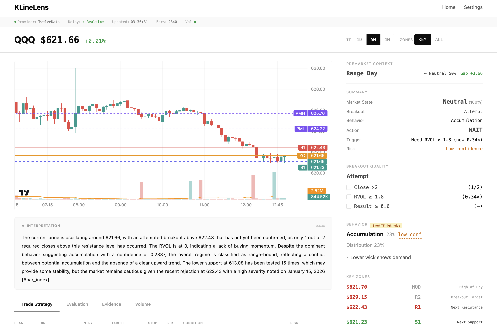

<h1 align="center">
  KLineLens
</h1>

<h3 align="center">
  Stop guessing. Start seeing market structure.
</h3>

<p align="center">
  <strong>Free, open-source trading analysis terminal</strong>
  <br>
  <em>Real-time structure analysis • Pluggable data providers • Custom trading strategies • AI insights</em>
</p>

<p align="center">
  <a href="#-quick-start">Quick Start</a> •
  <a href="#-features">Features</a> •
  <a href="#-custom-strategies">Custom Strategies</a> •
  <a href="#-documentation">Docs</a>
</p>

<p align="center">
  <a href="https://github.com/songzhiyuan98/KLineLens/releases"></a>
  <a href="https://github.com/songzhiyuan98/KLineLens/actions/workflows/ci.yml"></a>
  <a href="https://github.com/songzhiyuan98/KLineLens/stargazers"></a>
  <a href="https://github.com/songzhiyuan98/KLineLens/blob/main/LICENSE"></a>
  
</p>

<p align="center">
  
</p>

---

## 🎯 What is KLineLens?

KLineLens is an **open-source market structure analysis terminal** designed for day traders and options traders. It provides institutional-grade analysis capabilities for free:

- **Real-time structure detection** — Know if you're in uptrend, downtrend, or range
- **Smart breakout confirmation** — 3-factor validation to avoid fakeouts
- **Pluggable trading strategies** — Use built-in strategies or code your own
- **AI-powered interpretation** — GPT-4/Gemini integration for market narratives
- **Multi-language support** — Full Chinese and English interface

> 💡 **Built for 0DTE options traders** who need fast, accurate structure analysis during market hours.

---

## ✨ Core Features

### 📊 Market Structure Analysis
| Feature | Description |
|---------|-------------|
| **Trend Detection** | Uptrend / Downtrend / Range with confidence % |
| **Auto S/R Zones** | ATR-based support/resistance with strength scoring |
| **Breakout Quality** | 3-factor: Close ×2 + RVOL ≥ 1.8 + Result ≥ 0.6 ATR |
| **Behavior Inference** | Wyckoff-based: Accumulation, Distribution, Markup, etc. |

### 🌅 Extended Hours Intelligence
| Feature | Description |
|---------|-------------|
| **Premarket Regime** | Gap & Go, Gap Fill, Trend Continuation, Range Day |
| **Key Levels** | YC (Yesterday Close), PMH/PML (Premarket High/Low) |
| **Session Awareness** | Analysis adapts based on market session |

### 📋 Trading Strategies (Pluggable!)
| Strategy | Description |
|----------|-------------|
| **Playbook** | Conditional entry plans with entry/target/stop/R:R |
| **0DTE State Machine** | WAIT → WATCH → ARMED → ENTER → HOLD → TRIM → EXIT |
| **Custom** | 🔥 **Write your own strategy and plug it in!** |

### 🔌 Hot-Swappable Data Providers
| Provider | Free Tier | Volume Data | Setup |
|----------|-----------|-------------|-------|
| **Yahoo Finance** | Unlimited | Partial | No API key needed |
| **TwelveData** ⭐ | 800/day | ✅ Reliable | Free API key |
| **Alpaca** | Unlimited | ✅ Full | Free API key |
| **Alpha Vantage** | 25/day | ✅ Full | Free API key |

### 🌍 Multi-Language Support
- **中文** — 完整中文界面和 AI 解读
- **English** — Full English interface and AI interpretation
- Easy to add more languages via i18n system

---

## 🚀 Quick Start

### Prerequisites
- [Docker Desktop](https://www.docker.com/products/docker-desktop/) installed and running

### Step 1: Clone the Repository

```bash
git clone https://github.com/songzhiyuan98/KLineLens.git
cd KLineLens
```

### Step 2: Configure Environment

```bash
# Copy example config
cp .env.example .env
```

Edit `.env` with your preferred settings:

```bash
# ============ REQUIRED ============
# Data Provider (choose one)
PROVIDER=yahoo                    # Default, no API key needed

# ============ RECOMMENDED ============
# TwelveData - Better volume data, 800 free requests/day
# Get your free key: https://twelvedata.com/apikey
PROVIDER=twelvedata
TWELVEDATA_API_KEY=your_api_key_here

# ============ OPTIONAL ============
# Alpaca - Good for US stocks, unlimited requests
# Get your free key: https://app.alpaca.markets/signup
ALPACA_API_KEY=your_key
ALPACA_API_SECRET=your_secret

# Alpha Vantage - Premium data, 25 requests/day free
# Get your free key: https://www.alphavantage.co/support/#api-key
ALPHAVANTAGE_API_KEY=your_key

# ============ AI FEATURES (OPTIONAL) ============
# OpenAI GPT-4 - For AI market interpretation
# Get your key: https://platform.openai.com/api-keys
OPENAI_API_KEY=sk-your_key_here

# Google Gemini - Alternative AI provider
# Get your key: https://makersuite.google.com/app/apikey
GOOGLE_API_KEY=your_key_here

# ============ ADVANCED ============
CACHE_TTL=60                      # Cache duration in seconds
API_PORT=8000                     # Backend port
WEB_PORT=3000                     # Frontend port
```

### Step 3: Start the Application

```bash
# Build and start all services
docker compose up -d --build

# Check status
docker compose ps
```

### Step 4: Open Your Browser

```
http://localhost:3000
```

Type any ticker (TSLA, QQQ, AAPL, SPY...) and start analyzing!

### Stopping the Application

```bash
docker compose down
```

### Updating

```bash
git pull
docker compose up -d --build
```

---

## 🔑 API Keys Guide

| Provider | Free Tier | How to Get |
|----------|-----------|------------|
| **TwelveData** ⭐ | 800 req/day | 1. Go to [twelvedata.com](https://twelvedata.com)<br>2. Sign up for free<br>3. Go to Dashboard → API Keys |
| **Alpaca** | Unlimited | 1. Go to [alpaca.markets](https://app.alpaca.markets/signup)<br>2. Sign up for free paper trading<br>3. Go to API Keys section |
| **Alpha Vantage** | 25 req/day | 1. Go to [alphavantage.co](https://www.alphavantage.co/support/#api-key)<br>2. Fill the form<br>3. Get key via email |
| **OpenAI** | Pay-per-use | 1. Go to [platform.openai.com](https://platform.openai.com/api-keys)<br>2. Create account<br>3. Generate API key |
| **Google Gemini** | Free tier | 1. Go to [makersuite.google.com](https://makersuite.google.com/app/apikey)<br>2. Sign in with Google<br>3. Create API key |

> 💡 **Recommendation**: Start with Yahoo (no key needed), then upgrade to TwelveData for better volume data.

---

## 🎮 Custom Trading Strategies

**KLineLens is designed for extensibility.** You can create your own trading strategy and plug it directly into the system!

### Built-in Strategies

| Strategy | Description | Best For |
|----------|-------------|----------|
| **Playbook** | Conditional if-then plans based on structure | Swing trading, day trading |
| **0DTE** | Real-time state machine for same-day options | 0DTE options, scalping |

### Create Your Own Strategy

Want to implement your own trading logic? See our comprehensive guide:

📖 **[Custom Strategy Development Guide](docs/CUSTOM_STRATEGY.md)**

The guide covers:
- Strategy interface specification
- How to access market data and analysis
- State machine patterns
- Integrating with the frontend
- Testing and debugging
- Real examples

**Quick example:**

```python
# packages/core/src/strategies/my_strategy.py
from .base import BaseStrategy, StrategySignal

class MyCustomStrategy(BaseStrategy):
    """My custom trading strategy"""

    def analyze(self, snapshot: AnalysisSnapshot) -> StrategySignal:
        # Your logic here
        if snapshot.breakout_state == 'confirmed' and snapshot.rvol > 2.0:
            return StrategySignal(
                action='ENTER',
                direction='LONG',
                entry=snapshot.price,
                target=snapshot.r1,
                stop=snapshot.s1,
                reason='Breakout confirmed with strong volume'
            )
        return StrategySignal(action='WAIT')
```

Then register it in settings and it appears in your UI!

---

## 🏗️ Architecture

```
┌─────────────────────────────────────────────────────────────┐
│                    Next.js Frontend                          │
│  ┌─────────────────────────────────────────────────────┐    │
│  │  Chart • Zones • Strategy Panel • Timeline • AI     │    │
│  │  i18n (中文/English) • Settings • Watchlist         │    │
│  └─────────────────────────────────────────────────────┘    │
└──────────────────────────┬──────────────────────────────────┘
                           │ REST API + SSE
┌──────────────────────────▼──────────────────────────────────┐
│                    FastAPI Backend                           │
│  ┌─────────────────────────────────────────────────────┐    │
│  │              Analysis Engine (Pure Python)           │    │
│  │  Structure → Behavior → Zones → EH Context          │    │
│  └─────────────────────────────────────────────────────┘    │
│  ┌─────────────────────────────────────────────────────┐    │
│  │           Strategy Layer (Pluggable)                 │    │
│  │    Playbook │ 0DTE │ Custom Strategies               │    │
│  └─────────────────────────────────────────────────────┘    │
│  ┌─────────────────────────────────────────────────────┐    │
│  │           Provider Layer (Hot-Swappable)             │    │
│  │    Yahoo │ TwelveData │ Alpaca │ Alpha Vantage       │    │
│  └─────────────────────────────────────────────────────┘    │
└─────────────────────────────────────────────────────────────┘
```

---

## 📖 Documentation

| Document | Description |
|----------|-------------|
| **[ENGINE_SPEC.md](docs/ENGINE_SPEC.md)** | Core algorithm specification |
| **[CUSTOM_STRATEGY.md](docs/CUSTOM_STRATEGY.md)** | 🔥 Build your own strategy |
| **[API.md](docs/API.md)** | REST API reference |
| **[PROVIDER.md](docs/PROVIDER.md)** | Adding data providers |
| **[LLM_SPEC.md](docs/LLM_SPEC.md)** | AI integration guide |
| **[SIM_TRADER_SPEC.md](docs/SIM_TRADER_SPEC.md)** | 0DTE state machine spec |

---

## 🗺️ Roadmap

- [x] **v0.8** — Extended Hours, 0DTE strategy, custom strategies
- [x] **v0.7** — Responsive design, multi-language
- [x] **v0.6** — Terminal-style UI, AI interpretation
- [ ] **v1.0** — WebSocket streaming, signal backtesting
- [ ] **v1.1** — Dark mode, mobile support
- [ ] **v2.0** — Multi-timeframe, options chain integration

---

## 🤝 Contributing

We welcome contributions! Whether it's:

- 🐛 Bug fixes
- ✨ New features
- 📝 Documentation
- 🌍 Translations
- 🔌 New data providers
- 📋 Custom strategies

See **[CONTRIBUTING.md](CONTRIBUTING.md)** for guidelines.

```bash
# Development setup
cd apps/api && pip install -r requirements.txt && uvicorn src.main:app --reload
cd apps/web && npm install && npm run dev
```

---

## 📄 License

MIT License — Use freely for personal or commercial projects.

---

## ⚠️ Disclaimer

**For educational and informational purposes only.** This tool provides technical analysis based on price and volume data. It does not constitute financial advice. Past performance does not guarantee future results. Always do your own research and trade at your own risk.

---

<p align="center">
  <strong>If KLineLens helps your trading, consider giving it a ⭐</strong>
  <br>
  <sub>Built with ❤️ by traders, for traders</sub>
</p>
